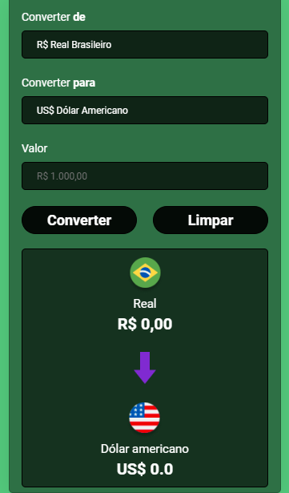

<h1 align="center">
  💰  Conversor de moedas
</h1>

  

<h4 align="center"><a href="https://helbamonteiro.github.io/Conversor-de-Moedas/">Clique para visitar o projeto</a></h4>

O objetivo desta ferramenta é facilitar a conversão de valores monetários entre diferentes moedas.

## Tecnologias Utilizadas

- **HTML:** Utilizado para criar a estrutura básica da página web.
- **CSS:** Responsável pela estilização da interface, proporcionando uma experiência visual atraente e intuitiva.
- **JavaScript:** O JavaScript desempenha um papel fundamental na conversão e funcionalidade da aplicação.

## Como Usar

1. Abra o arquivo `index.html` em seu navegador.
2. Escolha a moeda desejada em "Converter para"
3. Adicione o valor desejado.
4. Clique em converter 

## Contribuições

Contribuições são bem-vindas! Sinta-se à vontade para abrir issues, propor melhorias ou enviar pull requests.
